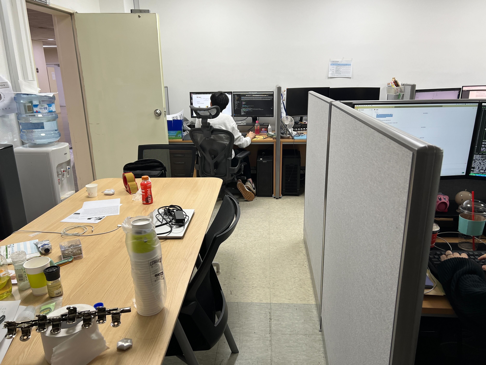
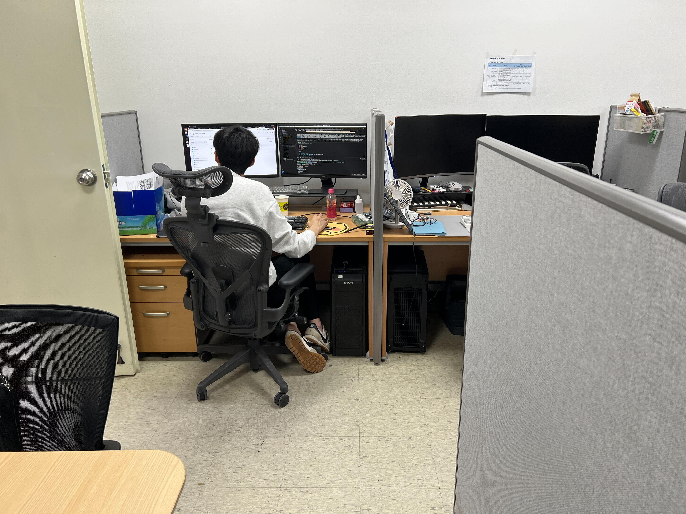

# [UNOFFICIAL] InstantSplat: Unbounded Sparse-view Pose-free Gaussian Splatting in 40 Seconds

### This is the unofficial implementation of the paper "InstantSplat: Unbounded Sparse-view Pose-free Gaussian Splatting in 40 Seconds".

Abstract: *Radiance Field methods have recently revolutionized novel-view synthesis of scenes captured with multiple photos or videos. However, achieving high visual quality still requires neural networks that are costly to train and render, while recent faster methods inevitably trade off speed for quality. For unbounded and complete scenes (rather than isolated objects) and 1080p resolution rendering, no current method can achieve real-time display rates. We introduce three key elements that allow us to achieve state-of-the-art visual quality while maintaining competitive training times and importantly allow high-quality real-time (≥ 30 fps) novel-view synthesis at 1080p resolution. First, starting from sparse points produced during camera calibration, we represent the scene with 3D Gaussians that preserve desirable properties of continuous volumetric radiance fields for scene optimization while avoiding unnecessary computation in empty space; Second, we perform interleaved optimization/density control of the 3D Gaussians, notably optimizing anisotropic covariance to achieve an accurate representation of the scene; Third, we develop a fast visibility-aware rendering algorithm that supports anisotropic splatting and both accelerates training and allows realtime rendering. We demonstrate state-of-the-art visual quality and real-time rendering on several established datasets.*

## Application example


### Input images

 |
--- | --- |

## Environment
```bash
docker pull gaetanlandreau/3d-gaussian-splatting
```
Then follow Dust3r environment settings from the [official repository](https://github.com/naver/dust3r) on the top of the docker environment.
```bash
pip install -r requirements.txt
```

## Training 
```bash
python train.py  -s {YOUR_DATASET_PATH} --exp_name {EXP_NAME} --eval --few_shot 12 --white_bg --iterations 1000
```
In case of training with your own dataset, you need to add `--own_data` flag to the command.
```bash
python train.py  -s {YOUR_DATASET_PATH} --exp_name {EXP_NAME} --white_bg --iterations 1000 --own_data
```

<section class="section" id="BibTeX">
  <div class="container is-max-desktop content">
    <h2 class="title">BibTeX</h2>
    <pre><code>@Article{kerbl3Dgaussians,
      author       = {Kerbl, Bernhard and Kopanas, Georgios and Leimk{\"u}hler, Thomas and Drettakis, George},
      title        = {3D Gaussian Splatting for Real-Time Radiance Field Rendering},
      journal      = {ACM Transactions on Graphics},
      number       = {4},
      volume       = {42},
      month        = {July},
      year         = {2023},
      url          = {https://repo-sam.inria.fr/fungraph/3d-gaussian-splatting/}
}</code></pre>
  </div>
</section>

```bibtex
@inproceedings{dust3r_cvpr24,
      title={DUSt3R: Geometric 3D Vision Made Easy}, 
      author={Shuzhe Wang and Vincent Leroy and Yohann Cabon and Boris Chidlovskii and Jerome Revaud},
      booktitle = {CVPR},
      year = {2024}
}

@misc{dust3r_arxiv23,
      title={DUSt3R: Geometric 3D Vision Made Easy}, 
      author={Shuzhe Wang and Vincent Leroy and Yohann Cabon and Boris Chidlovskii and Jerome Revaud},
      year={2023},
      eprint={2312.14132},
      archivePrefix={arXiv},
      primaryClass={cs.CV}
}

@misc{fan2024instantsplat,
        title={InstantSplat: Unbounded Sparse-view Pose-free Gaussian Splatting in 40 Seconds}, 
        author={Zhiwen Fan and Wenyan Cong and Kairun Wen and Kevin Wang and Jian Zhang and Xinghao Ding and Danfei Xu and Boris Ivanovic and Marco Pavone and Georgios Pavlakos and Zhangyang Wang and Yue Wang},
        year={2024},
        eprint={2403.20309},
        archivePrefix={arXiv},
        primaryClass={cs.CV}
      }

@misc{wild_gaussian_splatting_2024,
  title={Wild Gaussian Splatting},
  author={Daniel Kovalenko},
  year={2024},
  publisher={GitHub},
  howpublished={\url{https://github.com/nerlfield/wild-gaussian-splatting}}
}
```
